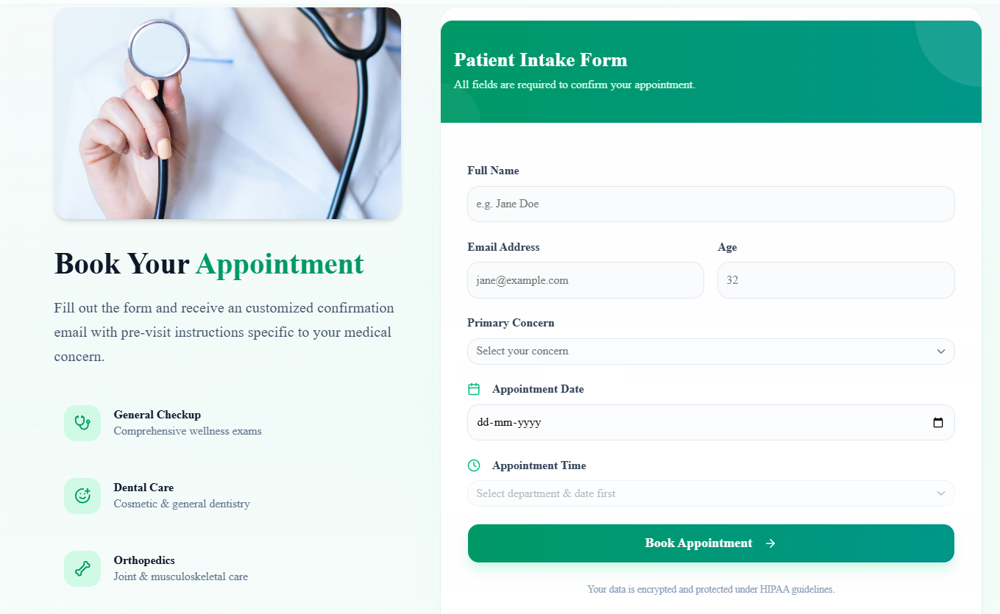
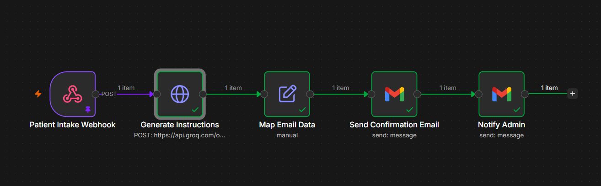

# CareFirst Health - Patient Intake Portal

A modern, responsive Next.js landing page integrated with an automated n8n workflow to handle patient intake, generate AI-drafted pre-visit instructions, and send confirmation emails.

## 🚀 Features
- **Modern UI/UX**: Built with Next.js, Tailwind CSS, and Framer Motion for beautiful animations.
- **Automated Webhooks**: Sends form data directly to an n8n webhook upon submission.
- **AI-Powered Instructions**: n8n uses the Groq API to draft personalized pre-visit instructions based on the patient's age and medical concern.
- **Automated Emails**: Sends a beautifully formatted HTML confirmation email to the patient using Gmail SMTP.

## 📸 Screenshots

### Landing Page

### n8n Automation Workflow

## 🤖 n8n Workflow Architecture

This workflow automates patient appointment confirmations for CareFirst Health with AI-generated pre-visit instructions:

**Technical Flow:**
1. **Patient Intake Webhook** (`n8n-nodes-base.webhook v2.1`): Receives POST requests at `/patient-intake` with patient data: `patientName`, `patientEmail`, `patientAge`, `concern`, `preferredSlot`
2. **Generate Instructions** (`n8n-nodes-base.httpRequest v4.2`): Calls Groq API (`https://api.groq.com/openai/v1/chat/completions`) using the `llama-3.1-8b-instant` model to generate 3-4 personalized pre-visit instructions based on the patient's concern and age.
3. **Map Email Data** (`n8n-nodes-base.set v3.4`): Extracts and structures data from webhook body and AI response (`choices[0].message.content`) into clean fields for email templates.
4. **Send Confirmation Email** (`n8n-nodes-base.gmail v2.2`): Sends an HTML-formatted appointment confirmation to the patient with:
   - Professional CareFirst Health branding
   - Appointment details (name, age, department, time/date)
   - AI-generated pre-visit instructions
   - Clinic location and contact info
   - HIPAA compliance footer
5. **Notify Admin** (`n8n-nodes-base.gmail v2.2`): Sends an HTML table summary to `madhurhita.ganguly@gmail.com` with all patient booking details for internal tracking.

**Credentials Used:** Groq API for AI generation, Gmail OAuth2 for email delivery.

## 🛠️ Tech Stack
- **Frontend**: Next.js 14, React, Tailwind CSS, Framer Motion, Lucide React
- **Automation**: n8n (Webhooks, Groq API, Gmail Node)
- **Deployment**: Vercel

## ⚙️ Setup Instructions
1. Clone the repository.
2. Run `npm install`.
3. Create a `.env` file and add your n8n webhook URL:
   `CAREFIRST_N8N_WEBHOOK_URL=https://madhurhitaganguly.app.n8n.cloud/webhook/patient-intake`
4. Run `npm run dev` to start the development server.
